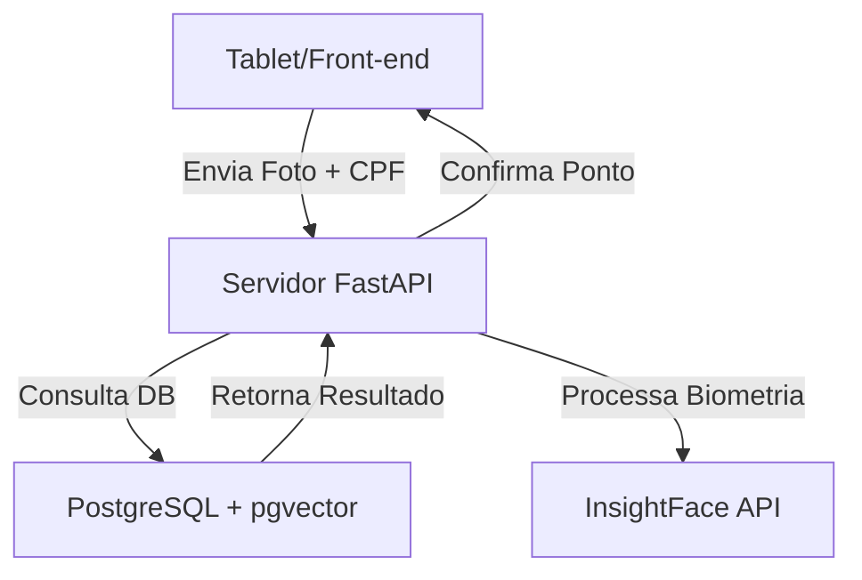

# 📊 Folha de Ponto

**Sistema de Controle de Frequência Biométrica para Administração Pública**

---

## 📌 Visão Geral
O **Folha de Ponto** é uma solução de engenharia voltada para a automação e transparência. Desenvolvido para atuar com alta disponibilidade, utiliza reconhecimento facial para garantir que o registro seja seguro e inviolável.

## ⚙️ Stack Tecnológico
| Categoria | Tecnologia |
| :--- | :--- |
| **Backend** | Python / FastAPI |
| **Banco de Dados** | PostgreSQL + pgvector |
| **Biometria** | InsightFace API |
| **Container** | Docker |

## 🏗 Arquitetura
O sistema opera através de um fluxo otimizado:
* **Captura**: Tablet (GitHub Pages/Front-end) envia a foto e o CPF do servidor.
* **Processamento**: O Servidor FastAPI processa a biometria via InsightFace e consulta o PostgreSQL.
* **Resultado**: Confirmação do ponto registrada e retornada para o usuário final.

## 🚀 Requisitos Funcionais e Não Funcionais

* **RNF01 (Segurança)**: Criptografia de ponta a ponta para dados biométricos e senhas.
* **RNF02 (Desempenho)**: Validação facial concluída em menos de 3 segundos.
* **RNF03 (Disponibilidade)**: Operação local independente de internet externa.
* **RNF04 (Usabilidade)**: Interface responsiva para repartições públicas.
* **RNF05 (Escalabilidade)**: Estrutura preparada para o crescimento da base de servidores.

---

### 👤 Desenvolvedor

**Autor**: Márcio Rodrigues de Oliveira

**Assinatura**: RAZGO TECNOLOGIA

Desenvolvido com excelência técnica
